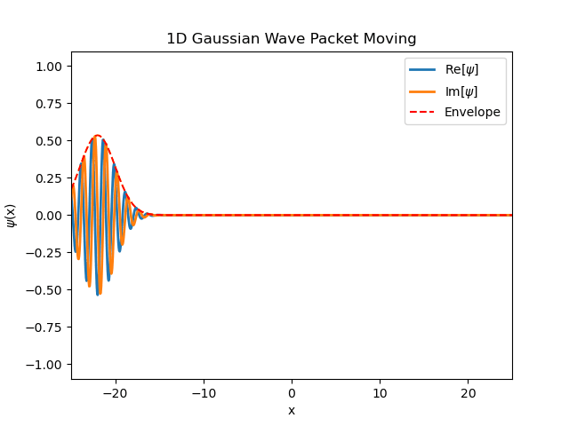
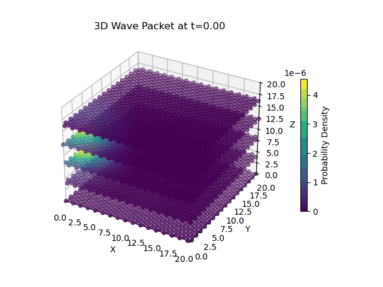

# Quantum Simulation
Author: Vedant Ravindra Kalkotwar

This repository contains Jupyter-based numerical simulations of quantum mechanical systems, focusing on the temporal evolution of wavefunctions and the visualization of probability densities.

1. Free Particle Wave Packet (1D)
Simulates a 1D Gaussian wave packet spreading over time. It visualizes the dispersion and phase shifts inherent in free-space evolution.

  

2. 3D Quantum Dynamics
Extends the simulation to three dimensions, tracking the spatial probability distribution of a particle in a 3D grid.

  

3. General Numerical Simulations
Tools for testing various initial conditions and observing resulting quantum behaviors through computational integration.

  

